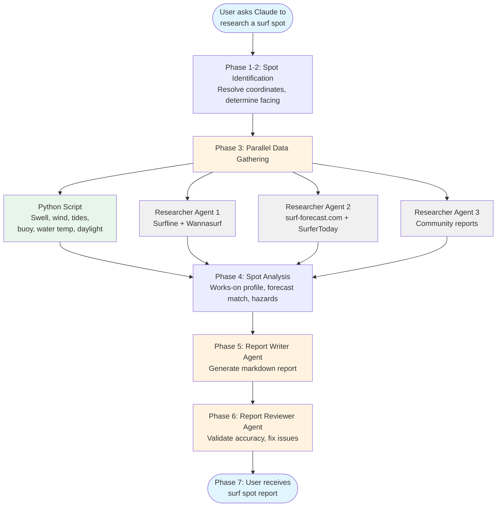

<h1 align="center">Surfing Skills for Claude Code</h1>

<h4 align="center">Automated surf spot research, built for <a href="https://claude.com/claude-code" target="_blank">Claude Code</a>.</h4>

<p align="center">
  <a href="#quick-start">Quick Start</a> •
  <a href="#how-it-works">How It Works</a> •
  <a href="#features">Features</a> •
  <a href="#installation">Installation</a> •
  <a href="#support">Support</a>
</p>

Ask Claude to research any surf spot. The spot-researcher skill pulls swell, wind, and tide forecasts, live NOAA buoy observations, spot guides, and community reports, then compiles a Markdown report with session windows keyed to tide, wind, and daylight, a full hazard breakdown, and a wetsuit recommendation.

---

## Quick Start

Install with [`npx skills`](https://github.com/vercel-labs/skills):

```
npx skills add EHernandez-dev/claude-surfing-skills
```

Then just ask naturally: `"Research Ocean Beach SF"`. Claude generates a surf spot report in your current directory.

> `npx skills` installs the `spot-researcher` skill, which drives the full workflow from natural-language requests. If you also want the `/surfing:*` slash commands, install the plugin instead, see [Installation](#installation).

**See it in action:**

| Spot | What it shows |
|------|---------------|
| [Ocean Beach, SF](skills/spot-researcher/examples/2026-07-08-ocean-beach-sf.md) | Expert-level beach break: buoy vs model cross-check, tide-keyed windows, hazard breakdown |

---

## How It Works

The skill uses a hybrid architecture: a Python script for deterministic API calls, LLM agents for tasks requiring judgment.



Three researcher agents gather data in parallel while a Python script fetches conditions. Dedicated agents write and review the final report. If a source fails, the skill documents the gap and continues.

---

## Features

### Data Sources

The skill aggregates from specialized surf sites and marine data APIs:

| Category | Sources |
|----------|---------|
| Spot guides | [Surfline](https://www.surfline.com), [Wannasurf](https://www.wannasurf.com), [surf-forecast.com](https://www.surf-forecast.com) |
| Marine forecast | [Open-Meteo Marine API](https://open-meteo.com) |
| Observations | [NOAA NDBC buoys](https://www.ndbc.noaa.gov) |
| Tides | [NOAA CO-OPS](https://tidesandcurrents.noaa.gov) (US only), [tide-forecast.com](https://www.tide-forecast.com) fallback |
| Wind & weather | [Open-Meteo](https://open-meteo.com) |
| Community | Reddit, surf forums |

**Coverage note:** The marine forecast works worldwide. Automatic tide predictions are US-only; non-US spots get a documented gap with manual lookup links. Report quality depends on how well-documented the spot is across these sources. Famous breaks get rich reports; obscure ones fall back to the Information Gaps pattern.

### Graceful Degradation

Missing data? The skill notes what's unavailable in an "Information Gaps" section and provides manual lookup links. You always get a report, even if some sources are down.

---

## Installation

**Prerequisites:** [Claude Code](https://docs.anthropic.com/en/docs/claude-code/overview), [Node.js](https://nodejs.org) (for `npx`), [uv](https://docs.astral.sh/uv/) for the Python tools.

### Recommended: `npx skills`

[`npx skills`](https://github.com/vercel-labs/skills) installs the `spot-researcher` skill directly:

```
npx skills add EHernandez-dev/claude-surfing-skills
```

Useful flags:

```
npx skills add EHernandez-dev/claude-surfing-skills --list   # preview before installing
npx skills add EHernandez-dev/claude-surfing-skills -g        # install globally (all projects)
npx skills add EHernandez-dev/claude-surfing-skills -y        # skip confirmation prompts
```

This gives you the full natural-language workflow (`"Research Ocean Beach SF"`). The `/surfing:*` slash commands are **not** included, install the plugin below if you want them.

### Alternative: Claude Code plugin

The plugin bundles the same skill plus the `/surfing:*` slash commands:

```
/plugin marketplace add EHernandez-dev/claude-surfing-skills
/plugin install surfing@surfing-marketplace
/reload-plugins
```

Python dependencies install automatically if `uv` is available. No restart needed, `/reload-plugins` activates the plugin in the current session.

---

## Usage

### Commands

| Command | What it does | Time |
|---------|-------------|------|
| `/surfing:research <spot>` | Full surf spot research report | 3-5 min |
| `/surfing:conditions <spot>` | Swell, wind, tides, buoy observation, wetsuit call | ~30 sec |
| `/surfing:windows <spot>` | Best session windows for this week | ~30 sec |
| `/surfing:week [spots]` | Ranked dashboard of the week's best windows across your home spots | ~1 min |
| `/surfing:briefing [--alert]` | Tomorrow's compact call across home spots; `--alert` fires only on a works-on match | ~30 sec |

### Natural Language

You can also just ask naturally:

```
"Research Ocean Beach SF"
"I'm going to Ericeira next week, what should I know about Ribeira d'Ilhas?"
"Generate a spot report for Pipeline"
```

Reports save to your current directory as `YYYY-MM-DD-spot-name.md`.

---

## Dependencies

- [Python tools](skills/spot-researcher/tools/README.md) - swell, wind, tide, buoy, and daylight calculations

---

## Contributing

Pull requests welcome. See [CONTRIBUTING.md](CONTRIBUTING.md).

---

## Support

[Open an issue](https://github.com/EHernandez-dev/claude-surfing-skills/issues) or start a discussion.

## Acknowledgements

This project is modeled on [claude-mountaineering-skills](https://github.com/dreamiurg/claude-mountaineering-skills) by [@dreamiurg](https://github.com/dreamiurg) (MIT), which pioneered the hybrid architecture used here: deterministic Python for API data, parallel researcher agents for judgment, and graceful degradation into an Information Gaps section. `cloudscrape.py` is adapted directly from that repo.

## License

[MIT](LICENSE)
