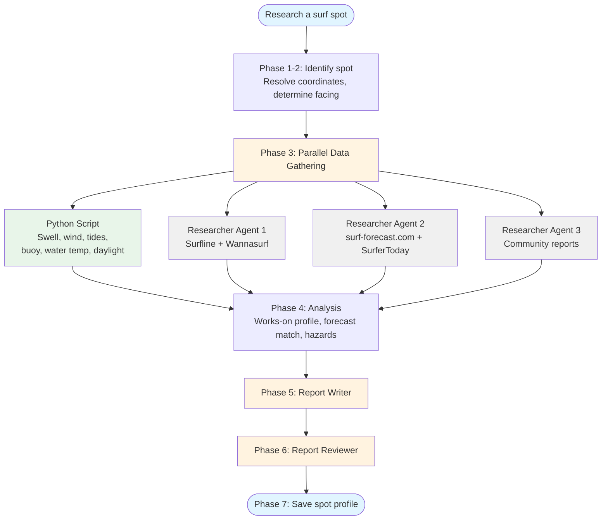

<h1 align="center">Surfing Skills for Claude Code</h1>

<h4 align="center">A surf companion, built for <a href="https://claude.com/claude-code" target="_blank">Claude Code</a>.</h4>

<p align="center">
  <a href="#quick-start">Quick Start</a> •
  <a href="#how-it-fits-together">How It Fits Together</a> •
  <a href="#commands">Commands</a> •
  <a href="#the-surf-folder">Surf Folder</a> •
  <a href="#data-sources">Data Sources</a> •
  <a href="#installation">Installation</a>
</p>

Research any surf spot once, then get instant, personalized morning calls forever. Claude pulls swell, wind, and tide forecasts, live buoy observations, spot guides, and community reports, and turns them into a spot-corrected verdict for the day: **Go**, **Worth a check**, or **Skip**. It remembers each spot you research, learns your quiver and skill level, ranks your week, and even learns how the forecast model misses your local break.

---

## Quick Start

Install the plugin (gives you the `/surfing:*` commands and the natural-language skill):

```
/plugin marketplace add EHernandez-dev/claude-surfing-skills
/plugin install surfing@surfing-marketplace
/reload-plugins
```

Then, from a folder you'll keep your surf data in:

```
/surfing:research Mundaka      # research a spot once (saves a reusable profile)
/surfing:conditions Mundaka    # instant conditions check, any morning after
/surfing:week                  # rank the week across your home spots
```

Or just ask naturally: `"Research Ocean Beach SF"`.

> Prefer the skill without the slash commands? `npx skills add EHernandez-dev/claude-surfing-skills` installs just the `spot-researcher` skill, which drives research from natural language. The daily-companion commands (`conditions`, `week`, `briefing`, `verify`) come with the plugin. See [Installation](#installation).

---

## How It Fits Together

The plugin is built around one idea: **research a spot once, reuse it forever.** Everything reads and writes a plain folder of files (your *surf folder*, no hidden state), so it stays yours and stays editable.

```
  ┌─ /surfing:research <spot> ──────────────┐
  │  full report + saves a spot profile     │   do this once per spot
  └──────────────────┬──────────────────────┘
                     │  spots/<slug>.yaml  (works-on profile, buoy, hazards)
                     ▼
  ┌─ daily use, now instant & personal ─────────────────────────────┐
  │  /surfing:conditions   one spot, right now                       │
  │  /surfing:windows      best session windows this week            │   every morning
  │  /surfing:week         ranked dashboard across your home spots   │
  │  /surfing:briefing     tomorrow's call (+ silent swell alert)    │
  └──────────────────┬──────────────────────────────────────────────┘
                     │  archives each forecast to forecasts/<slug>.jsonl
                     ▼
  ┌─ the learning loop ─────────────────────────────────────────────┐
  │  you log a session      → sessions/<date>-<slug>.md              │
  │  /surfing:verify <spot> → compares logs vs archived forecasts,   │   whenever you surf
  │                           stores the model bias in the profile   │
  └─────────────────────────────────────────────────────────────────┘
       the bias then sharpens every future conditions/week/briefing call
```

1. **Research once.** `/surfing:research` writes a full Markdown report *and* saves a **spot profile** (`spots/<slug>.yaml`): the conditions the spot works in, its coordinates and facing, the buoy to watch, hazards, and logistics.
2. **Tell it about you.** A **surfer profile** (`surfer.yaml`) holds your skill level, boards, home spots, unit preference, and target days. Now every verdict is made for *you*, a small clean day can be a Go for a beginner and a Skip for an expert.
3. **Daily checks are instant.** With a saved profile, `conditions`/`windows`/`week`/`briefing` skip all the web research: one deterministic fetch, verdicts corrected to the spot's own profile and weighed for you, in seconds.
4. **It learns your break.** Daily checks quietly archive the forecast. When you log a session, `/surfing:verify` compares what you got against what was predicted and stores a per-spot **model bias** ("under-calls size by ~0.3 m here"), which every later call then corrects for.

---

## Commands

| Command | What it does | Time |
|---------|-------------|------|
| `/surfing:research <spot>` | Full spot report (guide, hazards, logistics) + saves a reusable spot profile | 3-5 min |
| `/surfing:conditions <spot>` | Instant conditions check: swell, wind, tides, buoy, water temp, daylight, verdict | ~30 sec |
| `/surfing:windows <spot>` | Best session windows for one spot over the next 7 days | ~30 sec |
| `/surfing:week [spots]` | Ranked dashboard of the week's best windows across your home spots, plus a visual HTML page | ~1 min |
| `/surfing:briefing [--alert]` | Tomorrow's compact call across home spots; `--alert` stays silent unless a spot's works-on thresholds are forecast within 5 days | ~30 sec |
| `/surfing:verify <spot>` | Compares your session logs against archived forecasts and stores the learned model bias | ~30 sec |

Verdicts are always **Go / Worth a check / Skip**, corrected to the spot's works-on profile and personalized to your surfer profile, never a raw quality score. Reports save as `reports/{target-date}-{spot-slug}-{verdict}.md`, each with a self-contained HTML companion (map hero, tide curve with shaded session windows, hazards).

The daily commands run unattended too: schedule the briefing and the swell alert so the morning call comes to you. See [`docs/AUTOMATION.md`](docs/AUTOMATION.md).

**See it in action:**

| Report | What it shows |
|--------|---------------|
| [Ocean Beach, SF](skills/spot-researcher/examples/2026-07-08-ocean-beach-sf.md) | Expert beach break: buoy vs model cross-check, tide-keyed windows, hazard breakdown |
| [Verification loop at Mundaka](tests/end-to-end/2026-07-12-verify-mundaka-model-bias.md) | The full learn-from-your-sessions loop end to end |

---

## The Surf Folder

The plugin reads and writes everything in one working directory (the folder you run the commands from). Plain, human-editable files, nothing hidden elsewhere:

| Path | What it holds |
|------|---------------|
| `surfer.yaml` | Your profile: skill level, boards, home spots, unit preference, target days (copy [`surfer-template.yaml`](skills/spot-researcher/assets/surfer-template.yaml)) |
| `spots/<slug>.yaml` | One profile per researched spot: works-on conditions, coordinates, facing, buoy, hazards, and any learned model bias |
| `reports/` | Generated reports (`{target-date}-{spot-slug}-{verdict}.md`) and their HTML companions |
| `sessions/` | Your own session logs (`<date>-<slug>.md`), the input to the verification loop (template: [`session-log-template.md`](skills/spot-researcher/assets/session-log-template.md)) |
| `forecasts/<slug>.jsonl` | Append-only forecast snapshots, the archive `/surfing:verify` learns from |

To get started, copy the surfer template to `surfer.yaml`, list your `home_spots`, and research each of them once. Profiles never expire; every use shows the profile's age and suggests a refresh past roughly six months.

---

## How It Works

`/surfing:research` uses a hybrid architecture: a Python script for deterministic API calls, LLM agents for the parts that need judgment.



Three researcher agents gather data in parallel while a Python script fetches conditions; dedicated agents write and review the report; the final step saves the spot profile. If a source fails, the skill documents the gap and continues.

The **daily commands are much lighter**: no web research, no agents. They run the same Python conditions fetcher against your saved profiles (in parallel for multi-spot sweeps) and correct the verdicts to each spot's works-on profile. That is why they take seconds, not minutes.

---

## Data Sources

The marine forecast works **worldwide**; tide and observed-buoy coverage depend on region and degrade gracefully.

| Category | Sources |
|----------|---------|
| Spot guides | [Surfline](https://www.surfline.com), [Wannasurf](https://www.wannasurf.com), [surf-forecast.com](https://www.surf-forecast.com) (search-snippet level) |
| Marine forecast | [Open-Meteo Marine](https://open-meteo.com) (swell, period, direction, sea temp), worldwide |
| Observed buoys | [NOAA NDBC](https://www.ndbc.noaa.gov) (US and reach), [Puertos del Estado](https://portus.puertos.es) (Spain); a region-keyed registry other networks slot into |
| Tides | [NOAA CO-OPS](https://tidesandcurrents.noaa.gov) (US), [WorldTides](https://www.worldtides.info) worldwide behind an optional `WORLDTIDES_KEY` (chart datum), else a [tide-forecast.com](https://www.tide-forecast.com) fallback note |
| Wind & weather | [Open-Meteo](https://open-meteo.com) |
| Community | Reddit, regional surf forums |

**Units:** metric by default (heights in m, wind in km/h, temperatures in °C). Pass `--units imperial` (or set it in your surfer profile) for feet, knots, and °F. Precedence: the flag, then the surfer profile, then metric.

**Graceful degradation:** no source ever hard-fails a run. Missing data is noted in an Information Gaps section with manual-lookup links, and a flaky API degrades a single spot rather than breaking the report.

---

## Installation

**Prerequisites:** [Claude Code](https://docs.anthropic.com/en/docs/claude-code/overview), [Node.js](https://nodejs.org) (for `npx`), and [uv](https://docs.astral.sh/uv/) for the Python tools.

### Recommended: the plugin (full companion)

The plugin bundles the `spot-researcher` skill plus all the `/surfing:*` slash commands:

```
/plugin marketplace add EHernandez-dev/claude-surfing-skills
/plugin install surfing@surfing-marketplace
/reload-plugins
```

Python dependencies install automatically if `uv` is available. No restart needed; `/reload-plugins` activates the plugin in the current session.

### Alternative: `npx skills` (research skill only)

[`npx skills`](https://github.com/vercel-labs/skills) installs just the `spot-researcher` skill, the natural-language research workflow, without the daily-companion slash commands:

```
npx skills add EHernandez-dev/claude-surfing-skills
```

Useful flags:

```
npx skills add EHernandez-dev/claude-surfing-skills --list   # preview before installing
npx skills add EHernandez-dev/claude-surfing-skills -g        # install globally (all projects)
npx skills add EHernandez-dev/claude-surfing-skills -y        # skip confirmation prompts
```

### Optional: `WORLDTIDES_KEY`

Export a [WorldTides](https://www.worldtides.info) API key to get station-grade tide extremes outside US (NOAA) coverage. Without it, non-US spots fall back to a manual-lookup note; nothing breaks.

---

## Dependencies

- [Python tools](skills/spot-researcher/tools/README.md), the conditions fetcher, the deterministic HTML renderer, and the verification arithmetic

---

## Contributing

Pull requests welcome. See [CONTRIBUTING.md](CONTRIBUTING.md).

---

## Support

[Open an issue](https://github.com/EHernandez-dev/claude-surfing-skills/issues) or start a discussion.

## Acknowledgements

This project is modeled on [claude-mountaineering-skills](https://github.com/dreamiurg/claude-mountaineering-skills) by [@dreamiurg](https://github.com/dreamiurg) (MIT), which pioneered the hybrid architecture used here: deterministic Python for API data, parallel researcher agents for judgment, and graceful degradation into an Information Gaps section. `cloudscrape.py` is adapted directly from that repo.

## License

[MIT](LICENSE)
