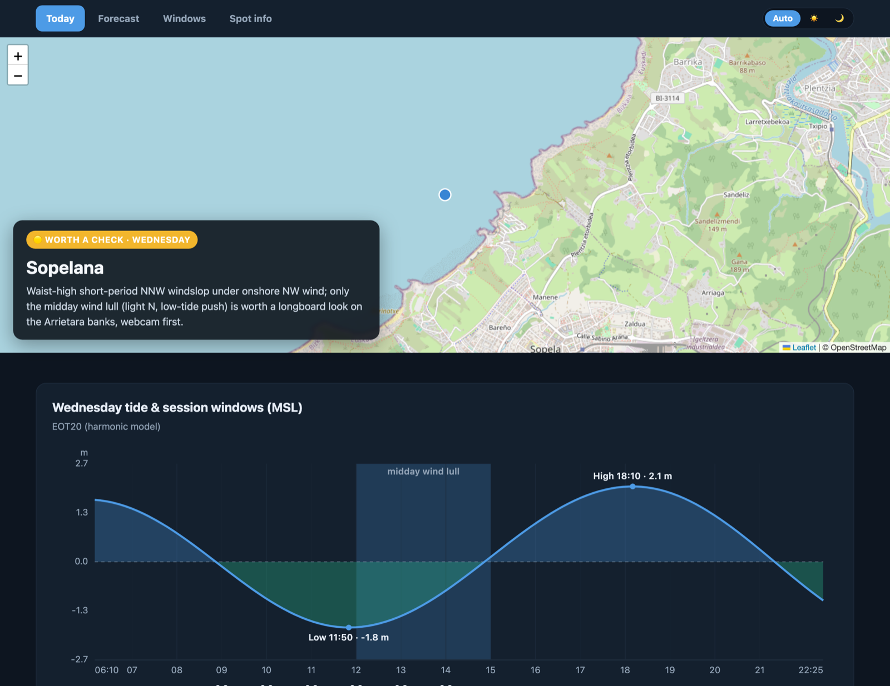
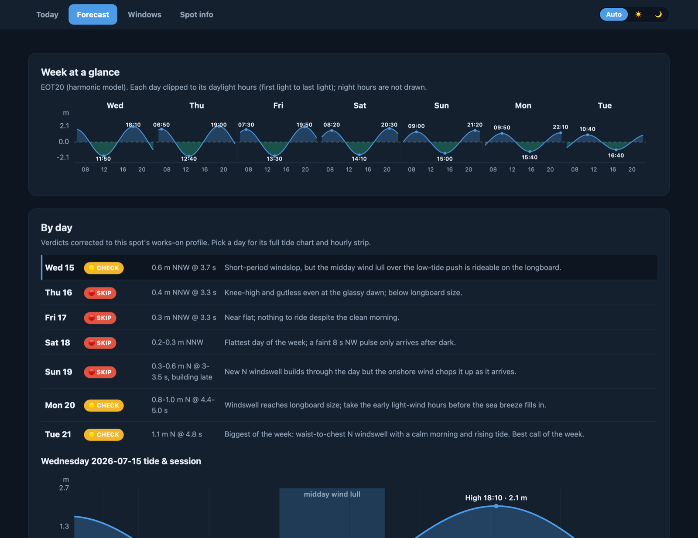
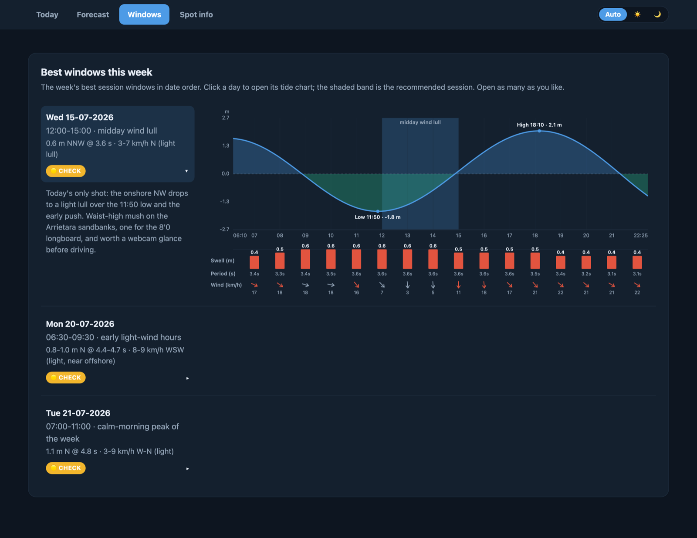
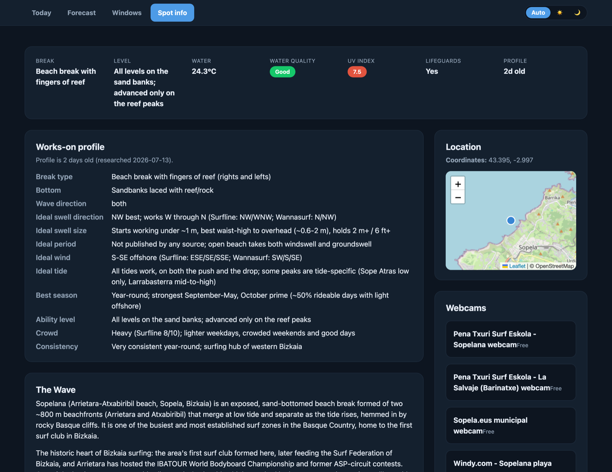
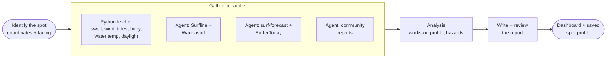

<h1 align="center">Surfing Skills for Claude Code</h1>

<h4 align="center">A surf companion, built for <a href="https://claude.com/claude-code" target="_blank">Claude Code</a>.</h4>

<p align="center">
  <a href="#quick-start">Quick Start</a> •
  <a href="#the-dashboard">The Dashboard</a> •
  <a href="#how-it-fits-together">How It Fits Together</a> •
  <a href="#commands">Commands</a> •
  <a href="#the-surf-folder">Surf Folder</a> •
  <a href="#data-sources">Data Sources</a> •
  <a href="#installation">Installation</a>
</p>

Research any surf spot once, then get instant, personalized morning calls forever. Claude pulls swell, wind, and tide forecasts, live buoy observations, spot guides, and community reports, and turns them into a spot-corrected verdict for the day: **Go**, **Worth a check**, or **Skip**. It remembers each spot you research, learns your quiver and skill level, ranks your week, and even learns how the forecast model misses your local break.



---

## Quick Start

Install the plugin (gives you the `/surfing:*` commands and the natural-language skill):

```
/plugin marketplace add EHernandez-dev/claude-surfing-skills
/plugin install surfing@surfing-marketplace
/reload-plugins
```

Then, from a folder you'll keep your surf data in:

```
/surfing:research Mundaka      # research a spot once (saves a reusable profile)
/surfing:dashboard Mundaka     # the full tabbed dashboard for a spot, in your browser
/surfing:conditions Mundaka    # instant conditions check, any morning after
/surfing:week                  # rank the week across your home spots
```

Or just ask naturally: `"Research Ocean Beach SF"`.

> Prefer the skill without the slash commands? `npx skills add EHernandez-dev/claude-surfing-skills` installs just the `spot-researcher` skill, which drives research from natural language. The daily-companion commands (`conditions`, `week`, `briefing`, `verify`) come with the plugin. See [Installation](#installation).

---

## The Dashboard

`/surfing:dashboard <spot>` builds a single self-contained HTML page and opens it in your browser: four tabs, no server, no build step. Add `fast` (`/surfing:dashboard Sopelana fast`) for a ~20 second computed-only build that skips the analyst pass.

**Today** (pictured above) leads with the verdict badge and a one-sentence call over a map of the spot, followed by the day's tide curve with the recommended session shaded and an hour-by-hour strip of swell, period, and wind aligned under it.

**Forecast** shows the week at a glance (each day's tide curve clipped to daylight) and a by-day verdict list, corrected to the spot's works-on profile. Pick any day to open its full tide chart and hourly strip.



**Windows** lists the week's best session windows in date order. Each one expands to its tide chart with the session band shaded and the hourly strip below, so you can see exactly why that window was picked.



**Spot info** is the spot's standing dossier, composed from the saved profile: the works-on profile (ideal swell, wind, tide, season), a description of the wave, hazards, access and parking, webcams, and nearby alternatives.



Every dashboard is theme-aware (auto, light, dark), saves a flat Markdown twin alongside the HTML, and re-running the command the same day simply refreshes the same file.

---

## How It Fits Together

The plugin is built around one idea: **research a spot once, reuse it forever.** Everything reads and writes a plain folder of files (your *surf folder*, no hidden state), so it stays yours and stays editable.

```
  ┌─ /surfing:research <spot> ──────────────┐
  │  full report + saves a spot profile     │   do this once per spot
  └──────────────────┬──────────────────────┘
                     │  spots/<slug>.yaml  (works-on profile, buoy, hazards)
                     ▼
  ┌─ daily use, now instant & personal ─────────────────────────────┐
  │  /surfing:dashboard    the tabbed HTML page for one spot         │
  │  /surfing:conditions   one spot, right now                       │
  │  /surfing:windows      best session windows this week            │   every morning
  │  /surfing:week         ranked dashboard across your home spots   │
  │  /surfing:briefing     tomorrow's call (+ silent swell alert)    │
  └──────────────────┬──────────────────────────────────────────────┘
                     │  archives each forecast to forecasts/<slug>.jsonl
                     ▼
  ┌─ the learning loop ─────────────────────────────────────────────┐
  │  you log a session      → sessions/<date>-<slug>.md              │
  │  /surfing:verify <spot> → compares logs vs archived forecasts,   │   whenever you surf
  │                           stores the model bias in the profile   │
  └─────────────────────────────────────────────────────────────────┘
       the bias then sharpens every future daily-use call
```

1. **Research once.** `/surfing:research` writes a full Markdown report *and* saves a **spot profile** (`spots/<slug>.yaml`): the conditions the spot works in, its coordinates and facing, the buoy to watch, hazards, and logistics.
2. **Tell it about you.** A **surfer profile** (`surfer.yaml`) holds your skill level, boards, home spots, unit preference, and target days. Now every verdict is made for *you*, a small clean day can be a Go for a beginner and a Skip for an expert.
3. **Daily checks are instant.** With a saved profile, `dashboard`/`conditions`/`windows`/`week`/`briefing` skip all the web research: one deterministic fetch, verdicts corrected to the spot's own profile and weighed for you, in seconds.
4. **It learns your break.** Daily checks quietly archive the forecast. When you log a session, `/surfing:verify` compares what you got against what was predicted and stores a per-spot **model bias** ("under-calls size by ~0.3 m here"), which every later call then corrects for.

---

## Commands

| Command | What it does | Time |
|---------|-------------|------|
| `/surfing:research <spot>` | Full spot report (guide, hazards, logistics), saves a reusable spot profile, opens the Dashboard | 3-5 min |
| `/surfing:dashboard <spot> [fast]` | The tabbed HTML [Dashboard](#the-dashboard) (Today / Forecast / Windows / Spot info), opened in your browser; `fast` skips the analyst pass | ~1 min (~20 sec fast) |
| `/surfing:conditions <spot>` | Instant conditions check: swell, wind, tides, buoy, water temp, daylight, verdict | ~30 sec |
| `/surfing:windows <spot>` | Best session windows for one spot over the next 7 days | ~30 sec |
| `/surfing:week [spots]` | Ranked dashboard of the week's best windows across your home spots, plus a visual HTML page | ~1 min |
| `/surfing:briefing [--alert]` | Tomorrow's compact call across home spots; `--alert` stays silent unless a spot's works-on thresholds are forecast within 5 days | ~30 sec |
| `/surfing:verify <spot>` | Compares your session logs against archived forecasts and stores the learned model bias | ~30 sec |

Verdicts are always **Go / Worth a check / Skip**, corrected to the spot's works-on profile and personalized to your surfer profile, never a raw quality score. The per-spot HTML output is the tabbed [Dashboard](#the-dashboard) (`reports/{target-date}-{spot-slug}-dashboard.html`, with a flat Markdown twin); `/surfing:research` additionally saves its full written report as `reports/{target-date}-{spot-slug}-{verdict}.md`, and `/surfing:week` renders its own multi-spot HTML page next to the ranked chat output.

The daily commands run unattended too: schedule the briefing and the swell alert so the morning call comes to you. See [`docs/AUTOMATION.md`](docs/AUTOMATION.md).

**See it in action:**

| Report | What it shows |
|--------|---------------|
| [Ocean Beach, SF](skills/spot-researcher/examples/2026-07-08-ocean-beach-sf.md) | Expert beach break: buoy vs model cross-check, tide-keyed windows, hazard breakdown |
| [Verification loop at Mundaka](tests/end-to-end/2026-07-12-verify-mundaka-model-bias.md) | The full learn-from-your-sessions loop end to end |

---

## The Surf Folder

The plugin reads and writes everything in one working directory (the folder you run the commands from). Plain, human-editable files, nothing hidden elsewhere:

| Path | What it holds |
|------|---------------|
| `surfer.yaml` | Your profile: skill level, boards, home spots, unit preference, target days (copy [`surfer-template.yaml`](skills/spot-researcher/assets/surfer-template.yaml)) |
| `spots/<slug>.yaml` | One profile per researched spot: works-on conditions, coordinates, facing, buoy, hazards, and any learned model bias |
| `reports/` | Per-spot Dashboards (`{target-date}-{spot-slug}-dashboard.html` + Markdown twin) and the research flow's written reports (`{target-date}-{spot-slug}-{verdict}.md`) |
| `sessions/` | Your own session logs (`<date>-<slug>.md`), the input to the verification loop (template: [`session-log-template.md`](skills/spot-researcher/assets/session-log-template.md)) |
| `forecasts/<slug>.jsonl` | Append-only forecast snapshots, the archive `/surfing:verify` learns from |

To get started, copy the surfer template to `surfer.yaml`, list your `home_spots`, and research each of them once. Profiles never expire; every use shows the profile's age and suggests a refresh past roughly six months.

---

## How It Works

`/surfing:research` uses a hybrid architecture: a Python script for deterministic API calls, LLM agents for the parts that need judgment.



Three researcher agents gather data in parallel while a Python script fetches conditions; dedicated agents write and review the report; the final step opens the Dashboard and saves the spot profile. If a source fails, the skill documents the gap and continues.

The **daily commands are much lighter**: no web research, no agents. They run the same Python conditions fetcher against your saved profiles (in parallel for multi-spot sweeps) and correct the verdicts to each spot's works-on profile. That is why they take seconds, not minutes.

---

## Data Sources

The marine forecast works **worldwide**, and so can tides: NOAA covers US coasts, and the free, keyless [EOT20](https://doi.org/10.17882/79489) global tide model covers everywhere else once set up (no API key, computed offline). Observed-buoy coverage depends on region. Everything degrades gracefully.

| Category | Sources |
|----------|---------|
| Spot guides | [Surfline](https://www.surfline.com), [Wannasurf](https://www.wannasurf.com), [surf-forecast.com](https://www.surf-forecast.com) (search-snippet level) |
| Marine forecast | [Open-Meteo Marine](https://open-meteo.com) (swell, period, direction, sea temp), worldwide |
| Observed buoys | [NOAA NDBC](https://www.ndbc.noaa.gov) (US and reach), [Puertos del Estado](https://portus.puertos.es) (Spain); a region-keyed registry other networks slot into |
| Tides | [NOAA CO-OPS](https://tidesandcurrents.noaa.gov) (US); [WorldTides](https://www.worldtides.info) behind an optional `WORLDTIDES_KEY` (station-grade, chart datum); the free keyless [EOT20](https://doi.org/10.17882/79489) global harmonic model everywhere else (offline, mean sea level; one-time setup, ADR 0004); else a [tide-forecast.com](https://www.tide-forecast.com) fallback note |
| Wind & weather | [Open-Meteo](https://open-meteo.com) |
| Community | Reddit, regional surf forums |

**Units:** metric by default (heights in m, wind in km/h, temperatures in °C). Pass `--units imperial` (or set it in your surfer profile) for feet, knots, and °F. Precedence: the flag, then the surfer profile, then metric.

**Graceful degradation:** no source ever hard-fails a run. Missing data is noted in an Information Gaps section with manual-lookup links, and a flaky API degrades a single spot rather than breaking the report.

---

## Installation

**Prerequisites:** [Claude Code](https://docs.anthropic.com/en/docs/claude-code/overview), [Node.js](https://nodejs.org) (for `npx`), and [uv](https://docs.astral.sh/uv/) for the Python tools.

### Recommended: the plugin (full companion)

The plugin bundles the `spot-researcher` skill plus all the `/surfing:*` slash commands:

```
/plugin marketplace add EHernandez-dev/claude-surfing-skills
/plugin install surfing@surfing-marketplace
/reload-plugins
```

Python dependencies install automatically if `uv` is available. No restart needed; `/reload-plugins` activates the plugin in the current session.

### Alternative: `npx skills` (research skill only)

[`npx skills`](https://github.com/vercel-labs/skills) installs just the `spot-researcher` skill, the natural-language research workflow, without the daily-companion slash commands:

```
npx skills add EHernandez-dev/claude-surfing-skills
```

Useful flags:

```
npx skills add EHernandez-dev/claude-surfing-skills --list   # preview before installing
npx skills add EHernandez-dev/claude-surfing-skills -g        # install globally (all projects)
npx skills add EHernandez-dev/claude-surfing-skills -y        # skip confirmation prompts
```

### Optional: free offline tides (EOT20)

Outside US (NOAA) coverage, tides can be predicted for free from the [EOT20](https://doi.org/10.17882/79489) global harmonic model, with no API key and no cost, computed locally (ADR 0004). One-time setup in the tools directory:

```
uv sync --extra tides                              # optional pyTMD + scientific stack
uv run --extra tides python download_tide_model.py # ~2 GB EOT20 model, downloaded once
```

After that, non-US spots get a real tide curve (and the tide chart's hourly strip) offline. Heights are relative to mean sea level, so the *timing* of highs and lows is exact while absolute heights read differently from a printed chart-datum table. Skip this and non-US spots simply fall back to a manual-lookup note; nothing breaks.

### Optional: `WORLDTIDES_KEY`

For station-grade extremes on chart datum (closer to printed local tables than EOT20's mean-sea-level heights), export a [WorldTides](https://www.worldtides.info) API key; it ranks above EOT20 when set. The free tier is limited, so EOT20 is the zero-cost default. Without either, non-US spots fall back to a manual-lookup note.

---

## Dependencies

- [Python tools](skills/spot-researcher/tools/README.md), the conditions fetcher, the deterministic HTML renderer, and the verification arithmetic

---

## Contributing

Pull requests welcome. See [CONTRIBUTING.md](CONTRIBUTING.md).

---

## Support

[Open an issue](https://github.com/EHernandez-dev/claude-surfing-skills/issues) or start a discussion.

## Acknowledgements

This project started as an adaptation of [claude-mountaineering-skills](https://github.com/dreamiurg/claude-mountaineering-skills) by [@dreamiurg](https://github.com/dreamiurg) (MIT), whose hybrid research pattern (deterministic Python for API data, parallel researcher agents for judgment, graceful degradation into an Information Gaps section) still shapes the research flow. Everything around that flow has since grown here: the spot and surfer profiles, the daily companion commands, the tabbed HTML Dashboard renderer, the offline tide model, and the forecast verification loop. `cloudscrape.py` remains adapted directly from the original repo.

## License

[MIT](LICENSE)
